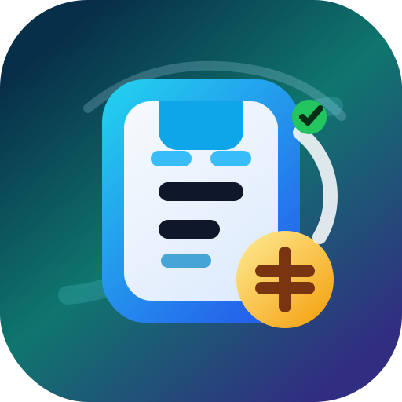

<p align="center">
  
</p>

# 📱 Sub-Tracker

> **eSIM 保号 & 订阅费用管理看板**
>
> 基于 Cloudflare Workers + KV 构建，零成本、高颜值、极度安全的个人资产管理面板。

告别忘记充值、眼睁睁看着靓号被回收的惨痛经历！前端展示、后端 API、定时提醒逻辑，全部浓缩在一个 Worker 内。

## ✨ 核心功能

- 🔐 **动态密码登录**：不在代码中写死密码，6位动态验证码，可通过 Telegram / Bark / 企业微信 / Webhook 接收
- 📱 **eSIM 保号管理**：号码到期监控、一键续期、智能区域识别
- 💳 **订阅费用管理**：分类管理各类订阅服务，费用统计
- 💰 **话费余额管理**：余额追踪、月租/扣费日管理、预计停机日计算、充值/校正
- ⏰ **智能到期提醒**：支持自定义提前提醒天数（30/15/7/3/1/当天），话费停机提醒
- 📣 **多渠道推送**：Telegram、Bark、企业微信机器人、通用 Webhook
- 🔄 **一键续期**：发完保号短信后，一键续期，自动顺延到期日
- 🧾 **操作历史**：记录最近 100 条新增、更新、删除、续期、充值和导入操作
- 📊 **增强统计**：按货币、分类统计月度/年度支出
- 📦 **PWA 支持**：Manifest + Service Worker，可添加到主屏幕并缓存应用壳
- 🌍 **智能区域识别**：输入带区号的号码，自动匹配 ISO 国家/地区代码
- 🎨 **毛玻璃 UI**：深色渐变背景 + Glassmorphism 设计，手机/PC 自适应

---

## 🚀 部署

### 方式一：Deploy 按钮（推荐新用户）

适合想直接使用、不关心代码的用户。点击后会自动 Fork 到你的账号并部署。

<p align="center">
  <a href="https://deploy.workers.cloudflare.com/?url=https://github.com/imwarn/sub-tracker">
    
  </a>
</p>

> ⚠️ 如果提示"已存在同名仓库"，换个名字即可（如 `my-sub-tracker`）。

### 方式二：Connect to Git（推荐仓库 Owner）

适合 Fork 过仓库或自己维护仓库的用户。

1. 登录 [Cloudflare Dashboard](https://dash.cloudflare.com/)
2. 左侧 → **Workers & Pages** → **Create Application**
3. 选择 **Connect to Git** → 授权 GitHub → 选择仓库
4. Build 配置：
   - Root directory: **留空**
   - Build command: **留空** 或 `npm run build`
   - Entry point: **`src/index.js`**
5. 点击 **Save and Deploy**
6. 部署后进入 **Settings** → **Variables and Secrets**，至少添加一种通知渠道：
   - `TG_BOT_TOKEN` — Telegram Bot Token
   - `TG_CHAT_ID` — Telegram Chat ID
   - 或配置 Bark / 企业微信 / Webhook，见下方「推送配置指南」

> 此后 push 到 main 分支会自动重新部署。

### 方式三：Wrangler CLI（本地开发）

需要 Node.js 22 或更高版本。

```bash
git clone https://github.com/imwarn/sub-tracker.git && cd sub-tracker
npm install
npx wrangler login
npx wrangler dev          # 本地开发
npx wrangler deploy       # 部署
```

---

## 🔑 环境变量

| 变量名 | 说明 | 配置方式 |
|---|---|---|
| `TG_BOT_TOKEN` | Telegram Bot Token | Deploy 时填写 / CF Dashboard / KV |
| `TG_CHAT_ID` | Telegram Chat ID | 同上 |
| `DEFAULT_NOTIFY_CHANNEL` | 普通提醒默认推送通道：`all` / `telegram` / `bark` / `wecom` / `webhook`，默认 `all` | 可选 |
| `AUTH_NOTIFY_CHANNEL` | 登录验证码推送通道：`telegram` / `bark` / `wecom` / `webhook` | 可选 |
| `BARK_KEY` / `BARK_URL` | Bark 推送 Key 或完整推送 URL | 可选 |
| `BARK_SERVER` | Bark 自建服务地址，默认 `https://api.day.app` | 可选 |
| `WECOM_WEBHOOK_URL` | 企业微信机器人 Webhook，兼容 `WECHAT_WORK_WEBHOOK_URL` | 可选 |
| `WEBHOOK_URL` | 通用 Webhook URL | 可选 |

代码优先读取 Worker 环境变量，其次读 KV 数据库。通知渠道至少配置一种即可。

### 推送配置指南

> 🟢 已验证　🟡 未验证

**Telegram** 🟢

1. 找 `@BotFather` 创建 Bot，得到 `TG_BOT_TOKEN`
2. 给 Bot 发一条消息，再通过 `@userinfobot` 或 Bot API 获取 `TG_CHAT_ID`
3. 未指定单一默认通道时，登录验证码会优先走 Telegram

**Bark** 🟢

1. iOS 安装 Bark，复制设备 Key
2. 设置 `BARK_KEY=<你的 Key>`；如果使用自建 Bark 服务，再设置 `BARK_SERVER=https://你的服务地址`
3. 也可以直接设置完整推送地址 `BARK_URL=https://api.day.app/<key>`，此时 `BARK_URL` 优先

**企业微信机器人** 🟡

1. 在企业微信群中添加「群机器人」
2. 复制 Webhook 地址到 `WECOM_WEBHOOK_URL`
3. 如果群里不只你一个人，不建议用它接收登录验证码

> 暂无企业微信环境，未实际验证。欢迎反馈测试结果。

**通用 Webhook** 🟢

设置 `WEBHOOK_URL` 后，系统会向该地址 POST JSON：

```json
{
  "source": "sub-tracker",
  "title": "Sub-Tracker",
  "text": "去掉 HTML 标签后的纯文本",
  "html": "原始 HTML 消息",
  "timestamp": "2026-06-03T00:00:00.000Z"
}
```

已验证平台：**飞书（Lark）自定义机器人 Webhook**。

> ⚠️ 部分 Webhook 平台支持关键词过滤（如飞书、企业微信），会根据消息内容决定是否放行。所有通知标题均包含 `Sub-Tracker`（如 `【Sub-Tracker 到期提醒】`），配置关键词白名单时添加 `Sub-Tracker` 即可保证推送正常接收。

> ℹ️ 目前仅测试了部分通道组合，未覆盖所有排列。如遇到问题欢迎反馈。

### 默认通道与登录验证码

`DEFAULT_NOTIFY_CHANNEL` 控制普通提醒和测试通知：

- 不填或设为 `all`：发送到全部已配置渠道，保持旧版行为
- 设为 `telegram` / `bark` / `wecom` / `webhook`：只发送到指定渠道

`AUTH_NOTIFY_CHANNEL` 控制登录动态验证码：

- 不填时：如果 `DEFAULT_NOTIFY_CHANNEL` 是单一通道，就沿用它；否则优先 Telegram，再使用第一个已配置渠道
- 设置后：验证码只发送到指定渠道

如果不想用 Telegram 接收登录验证码，**Bark 是最适合替代 TG 动态密码登录的通道**，因为它通常只推到你的个人设备。企业微信和通用 Webhook 也能接验证码，但前者要确保机器人所在群只有可信成员，后者要确保你的 Webhook 端点私密、可靠且能即时提醒。

---

## 📄 许可证

MIT License
